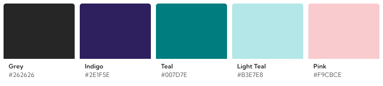

# Wagtail brand guidelines and assets

Design assets relating to the Wagtail brand – for merchandise, marketing, and more.

## Logo

## Color

Wagtail marketing assets use a reduced palette (derived from a more comprehensive [colour system used in Wagtail CMS](https://docs.wagtail.org/en/stable/advanced_topics/customisation/admin_templates.html#id3)).

| Color      | Hex code  | Aliases                   |
| ---------- | --------- | ------------------------- |
| Grey       | `#262626` | grey-600                  |
| Indigo     | `#2E1F5E` | primary / primary-100     |
| Teal       | `#007D7E` | secondary / secondary-200 |
| Light Teal | `#B3E7E8` |                           |
| Pink       | `#F9CBCE` |                           |

## Typeface

The master typeface for all Wagtail marketing (inc. wagtail.org) is [Kumbh Sans](https://fonts.google.com/specimen/Kumbh+Sans) (a free Google font). Note: the Wagtail CMS uses a different font stack.
